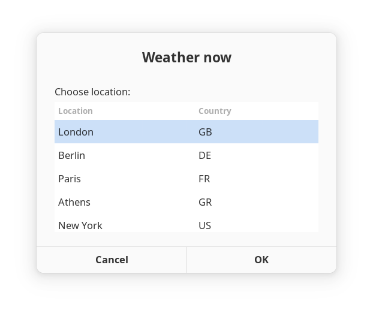
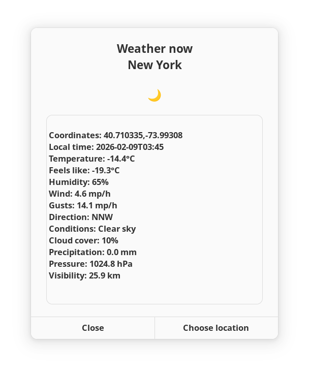
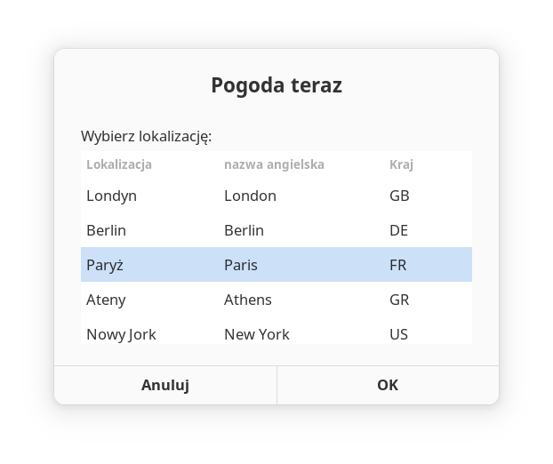
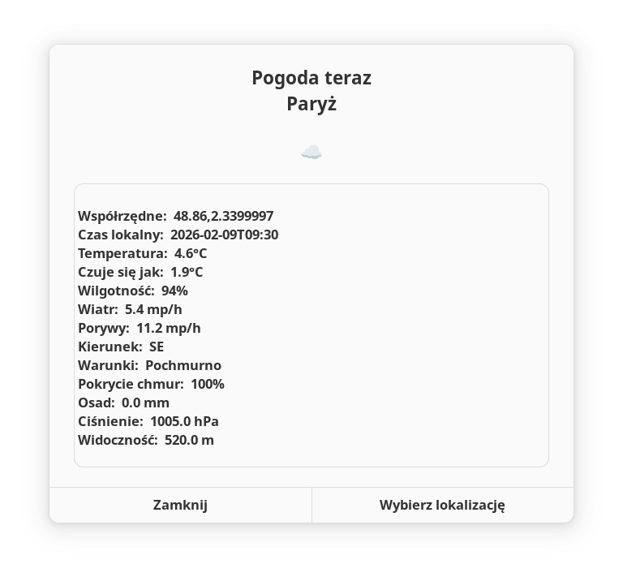
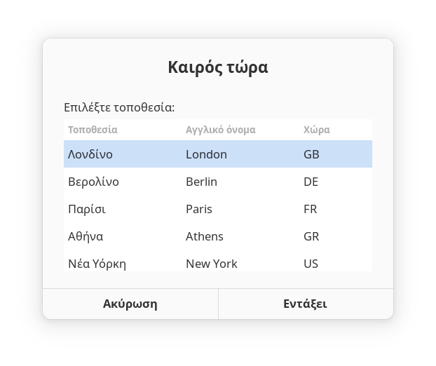
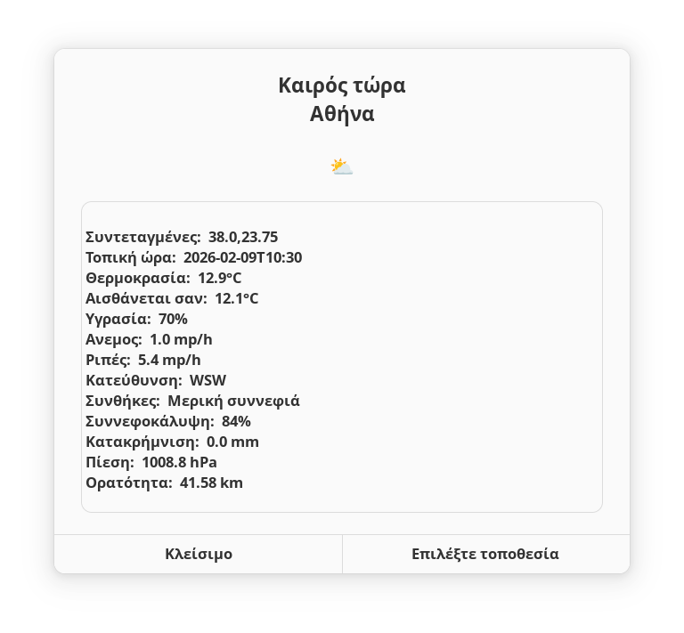
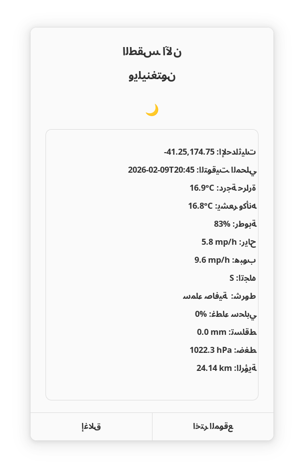

# weather-now

## [**weather_now.py**](weather_now.py)

A Python scipt to display [Open-Meteo API](https://open-meteo.com/en/docs) data for current weather on the command line. It is based on code originally published under the [MIT](https://opensource.org/license/mit) licence, with minor adaptations (see [**changelog**](CHANGELOG.md)).

```
usage: weather_now.py [-l <placename>] [-c <country_code>]
                      [-t [celsius|fahrenheit]] [-p [mm|inch]] [-w [kmh|ms|mph|kn]]
                      [-d] [-o [classic|data|data-alt]]

       When - is appended, read additional weather parameters from standard input.

options:
  -h, --help  show this help message and exit
  -l          location placename (defaults to London if omitted)
  -c          country code (defaults to GB if omitted)
  -t          temperature unit: celsius or fahrenheit
  -p          precipitation unit: mm or inch
  -w          wind speed unit: kmh, ms, mph or kn
  -d          wind direction: show in degrees
  -o          output style: classic (heading, ascii art and data),
              data (just data) or data-alt (conditions code and description)
```


## [**weather-now-menu**](weather-now-menu)

A Bash wrapper for [**weather_now.py**](weather_now.py) driven by [Zenity*](https://help.gnome.org/users/zenity/stable/index.html.en) dialogs. Multilingual dialog and weather labels are generated by [translate-shell**](https://github.com/soimort/translate-shell) - apologies if any are impolite or ridiculous. (* Required dependency, ** optional dependency.)

```
Usage:

Translate locations and labels before displaying current weather:

    weather-now-menu [language code, per $ trans --list-all]

Display current weather and dialog labels in English, or per last supplied language code:

    weather-now
```

## More information

Edit [**locations**](locations) as required.

Edit [**weather-now-menu.conf**](weather-now-menu.conf) to change weather parameter units.

If any translations are inappropriate, edit the following dynamically generated files:

```
locations-native
labels-native
conditions-native
```

NB Any subsequent change of language will overwrite alterations.

**Important! In the case of RTL languages, weather-now-menu must be run from a terminal that fully supports RTL languages, e.g. gnome-terminal or KDE Konsole. If running from the VSCode integrated terminal (as of v1.109.2), expect labels-native to contain translations rendered back to front, i.e. nonsense.**

## Specialist configs

Replace the weather-now-menu.conf in your script folder with one of these:

| Config name                                               | Additional weather parameters                                      |
| :-------------------------------------------------------: | :----------------------------------------------------------------: |
| [severe](configs/severe/weather-now-menu.conf)            | cape, lifted_index, convective_inhibition,                         |
|                                                           | total_column_integrated_water_vapour, lightning_potential         |                                |
| [aviation](configs/aviation/weather-now-menu.conf)        | wind_speed_80m, wind_speed_120m, wind_speed_180m,                  |
|                                                           | wind_direction_80m, wind_direction_120m, wind_direction_180m,      |
|                                                           | dew_point_2m, temperature_80m, temperature_120m, temperature_180m, |
|                                                           | temperature_1000hPa, temperature_850hPa, temperature_500hPa,       |
|                                                           | freezing_level_height, cloud_cover_low, cloud_cover_mid,           |
|                                                           | cloud_cover_high, cape, lifted_index, lightning_potential,         |
|                                                           | snowfall, snow_depth                                               |
| [agriculture](configs/agriculture/weather-now-menu.conf)  | vapour_pressure_deficit, evapotranspiration, dew_point_2m,         |
|                                                           | soil_moisture_0_to_1cm, soil_moisture_3_to_9cm,                    |
|                                                           | soil_moisture_9_to_27cm, soil_moisture_27_to_81cm,                 |
|                                                           | soil_temperature_0cm, soil_temperature_6cm, soil_temperature_18cm, |
|                                                           | soil_temperature_54cm                                              |
| [alpine](configs/alpine/weather-now-menu.conf)            | snowfall, snow_depth, snowfall_height                              |

Create your own as required.

**Important! After dropping a specialist config into the script folder, you must run weather-now-menu with your language code  to rebuild weather parameter translations.**

Notes:
1. Weather is displayed in a scrollable zenity --text-info
2. RESULTS_FONT is Noto Sans Bold, change to suit.
3. WIND_IN_DEGREES can be commented out to display wind_direction_10m as a compass ordinal.</br>

## Screenshots

Note: As of Zenity v4.0.1, it does not seem possible to coerce --text and --column for right justification of RTL languages.</br></br>

| Locations                                  | Weather                                |
| :----------------------------------------: | :------------------------------------: |
|  |  |
|  |  |
|  |  |
|  |  |
